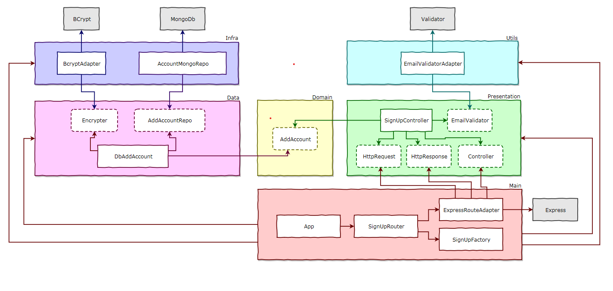

# 💫 About Project:
Quer construir aplicações robustas, escaláveis e fáceis de manter? Adote Clean Architecture e SOLID com Node.js! Ao seguir essas boas práticas, você garante que sua arquitetura será clara, organizada e mantível ao longo do tempo. Além disso, sua equipe será capaz de trabalhar de forma mais eficiente, sem se perder em complexidade e bagunça. Vamos juntos construir aplicações incríveis, seguindo esses padrões de alta qualidade.

# 💻 Tech Stack:
    
# 📊 Diagrama:
